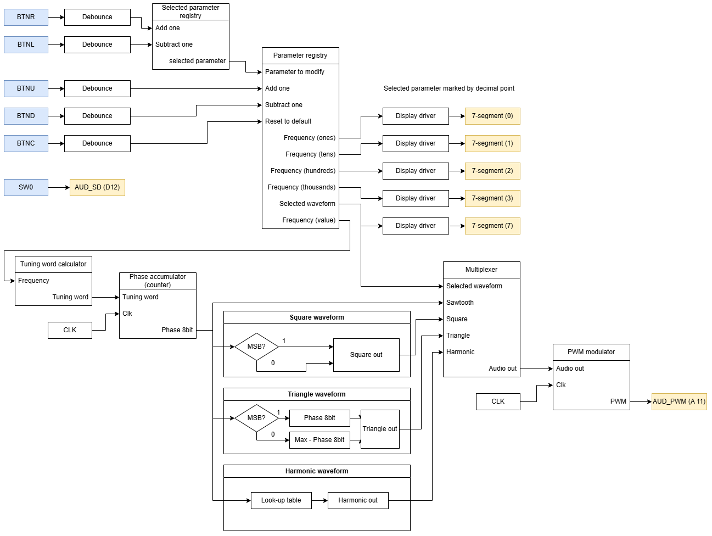
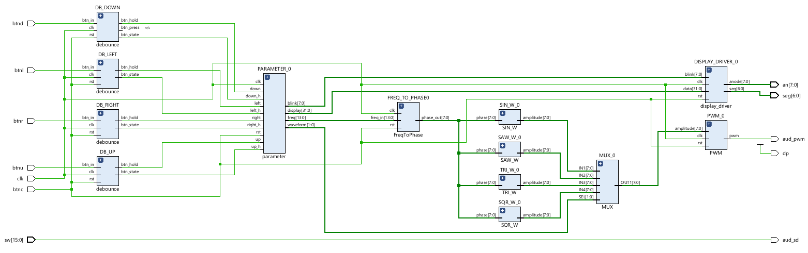
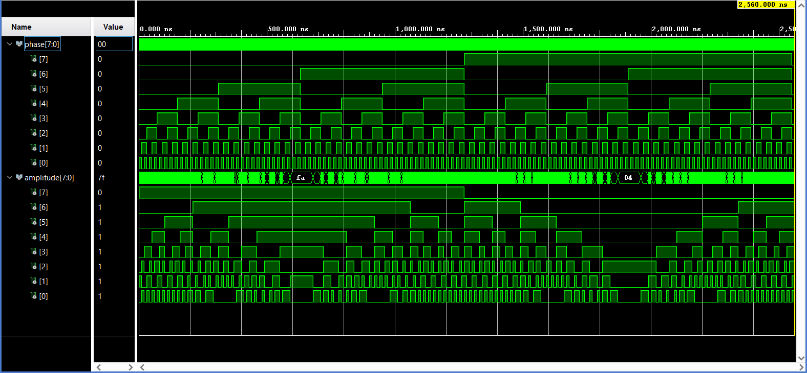
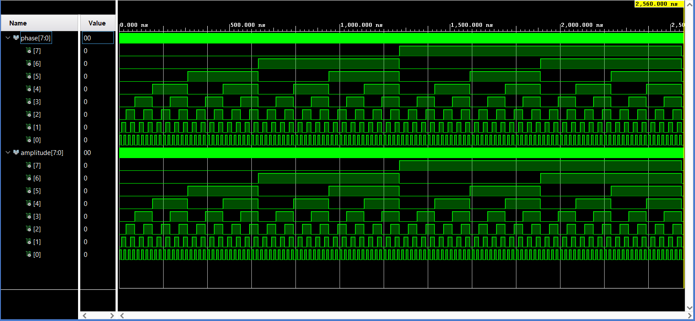
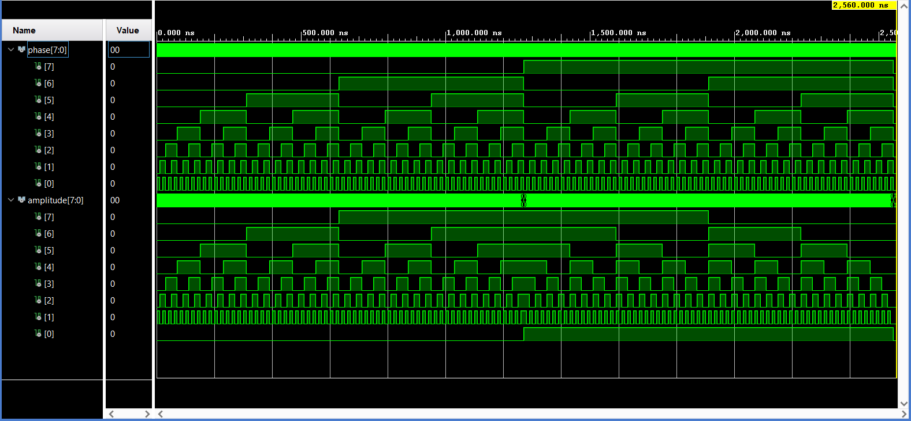
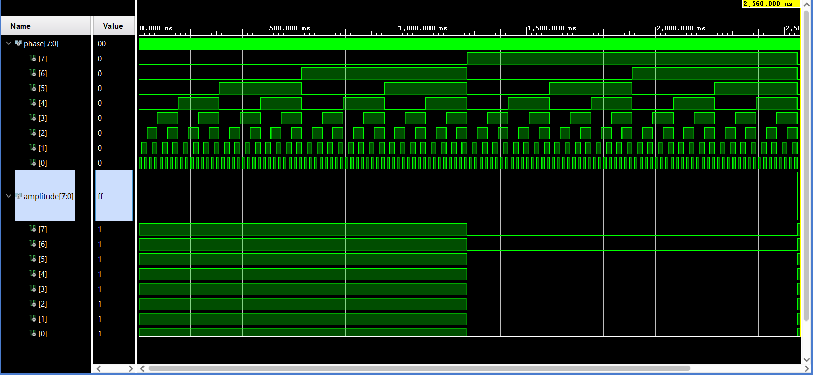
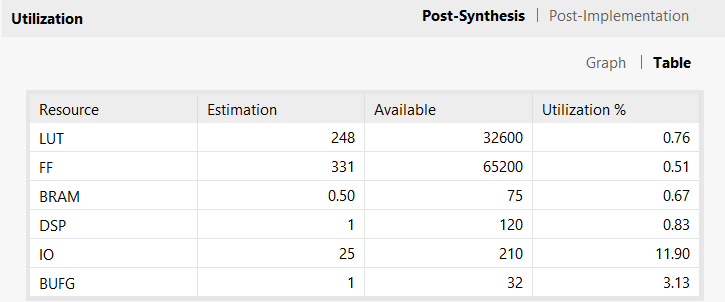
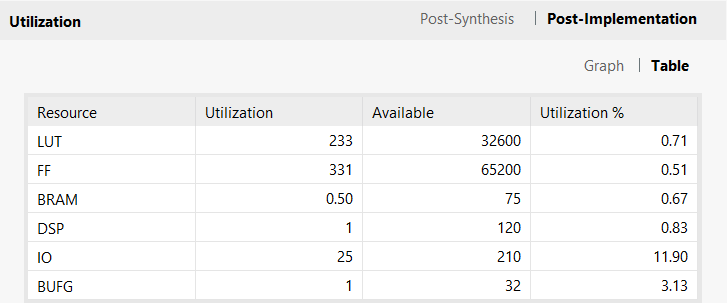
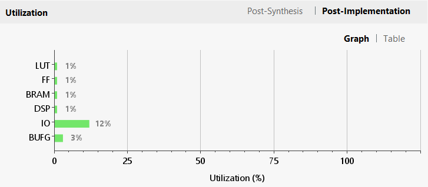

# DE1-waveform-gen

Cílem tohoto projektu je vytvořit funkční digitální generátor průběhů implementovaný na vývojové desce **Nexys A7-50T**. 

Generátor umožňuje uživateli přepínat mezi čtyřmi základními typy signálů:
* Harmonický průběh (Sinus)
* Obdélníkový průběh (Square)
* Trojúhelníkový průběh (Triangle)
* Pilovitý průběh (Sawtooth)

Frekvenci výstupního signálu lze nastavovat v rozsahu **od 1 Hz do 10 kHz**. Uživatelské rozhraní je řešeno pomocí tlačítek na desce pro výběr a úpravu parametrů, přičemž aktuální stav je zobrazován na sedmisegmentovém displeji. Editovaný parametr je pro lepší orientaci vizuálně indikován blikáním segmentu.

## Blokové schéma

**Původní koncept:**

**Konečné provedení:**

## Vstupy

Ovládání je navrženo pomocí integrovaných tlačítek a přepínačů na desce Nexys:

**Tlačítka:**
* **`BTNR`** - Výběr parametru pro modifikaci (posun vpřed).
* **`BTNL`** - Výběr parametru pro modifikaci (posun vzad).
* **`BTNU`** - Modifikace zvoleného parametru (inkrementace / +1).
* **`BTND`** - Modifikace zvoleného parametru (dekrementace / -1).
* **`BTNC`** - Reset systému do výchozího nastavení.

**Přepínače:**
* **`SW0`** - Hlavní vypínač pro povolení/zakázání audio výstupu (`AUD_SD`, pin D12).

## Výstupy

Nastavené parametry a generovaný signál jsou vyvedeny na následující periferie:

**Sedmisegmentový displej:**
* **Nultý segment (DISP 0)** - Zobrazení jednotkové složky nastaveného kmitočtu.
* **První segment (DISP 1)** - Zobrazení desítkové složky nastaveného kmitočtu.
* **Druhý segment (DISP 2)** - Zobrazení stovkové složky nastaveného kmitočtu.
* **Třetí segment (DISP 3)** - Zobrazení tisícové složky nastaveného kmitočtu.
* **Sedmý segment (DISP 7)** - Indikace aktuálně zvoleného typu průběhu.

**Audio Výstup:**
* PWM modulovaný signál vyvedený do 3.5mm jack konektoru na desce (aktivní pouze při zapnutém `SW0`).

## Simulace

**Debounce**

Upravený debounce obsahuje výstup btn_hold, který při držení tlačítka opakovaně generuje impulzy s nastavenou periodou.

**Výběr segmentů**

Přepínání parametru k modifikaci pomocí tlačítek bylo nutné ošetřit, aby se zobrazovaly na správném segmentu. V simulaci je vidět přetékání registru pro výběr segmentu, kde přepínáme mezi modifikací velikosti frekvence (segmenty 0, 1, 2, 3, 4) a modifikací zvoleného průběhu (segment 7), segmenty 5 a 6 vynecháváme. Simulace byla provedena v obou směrech přepínání.

**Blikání segmentu**

Pro lepší orientaci uživatele v právě zvoleném parametru segment zvoleného parametru bliká.

**Ošetření frekvence**

Při nastavení nulové frekvence uživatelem je automaticky nastavená frekvence 1 Hz (ošetření lze vidět v první polovině simulace). V případě, že by se uživatel pokoušel nastavit frekvenci větší než maximum (10 kHz), pak se provede automatické ošetření pro zpětné přenastavení na maximální kmitočet (ošetření lze pozorovat v druhé polovině simulace).

**Převod frekvence na fázový krok**

V závislosti na frekvenci se mění rychlost změny fáze průběhu

**Převod amplitudy průběhu na PWM**

Pulzně šířková modulace je tvořena podle velikosti amplitudy zvoleného průběhu 

**Harmonický průběh**

**Pilovitý průběh**

**Trojúhelníkový průběh**

**Obdélníkový průběh**

## Reporty

**Využití zdrojů po syntéze**

**Využití zdrojů po implementaci**

**Využití zdrojů po implementaci (graf)**

